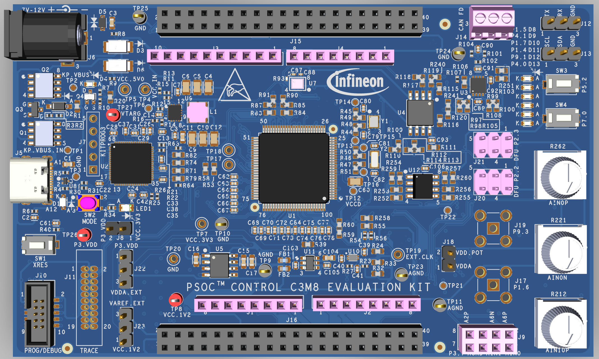

# KIT_PSC3M8_EVK BSP

## Overview

The PSOC™ Control C3M8 MCU Evaluation Kit (KIT_PSC3M8_EVK) is based on the PSOC™ Control family of devices. It enables the evaluation and development of applications for the PSOC™ Control C3M8 MCU.

To use code from the BSP, simply include a reference to `cybsp.h`.

## Features

Kit Features:

- PSoC™ Control C3M8 (Arm® Cortex®-M33 based) Microcontroller
- On-board Debug Probe with USB interface supporting SWD
- J-Link debugger and UART virtual COM port, with USB Type C connector
- Two user LEDs, two user buttons, and a reset button for the PSC3M8
- USB device and host function
- All IOs available on expansion header
- On board SPI Nor flash
- Headers compatible with Arduino Uno R3
- Potentiometer that can be used to simulate analog sensor output

Kit Contents:

- PSOC™ Control C3M8 Evaluation Kit
- USB Type-A to Type-C cable
- Jumper wires

## BSP Configuration

The BSP has a few hooks that allow its behavior to be configured. Some of these items are enabled by default while others must be explicitly enabled. Items enabled by default are specified in the KIT_PSC3M8_EVK.mk file. The items that are enabled can be changed by creating a custom BSP or by editing the application makefile.

### Clock Configuration

|  Clock  |   Source  | Output Frequency |
| :-----: | :-------: | :--------------: |
|   FLL   |    IHO    |    100.0 MHz     |
| CLK_HF0 | CLK_PATH1 |     180 MHz      |
| CLK_HF1 | CLK_PATH1 |     180 MHz      |
| CLK_HF2 | CLK_PATH1 |     180 MHz      |
| CLK_HF3 | CLK_PATH2 |     200 MHz      |
| CLK_HF4 | CLK_PATH2 |     200 MHz      |

### Power Configuration

* System Active Power Mode: OD
* System Idle Power Mode: CPU Sleep
* VDDA Voltage: 3300 mV
* VDDD Voltage: 3300 mV

See the [BSP Setttings][settings] for additional board specific configuration settings.

## API Reference Manual

The KIT_PSC3M8_EVK Board Support Package provides a set of APIs to configure, initialize and use the board resources.

See the [BSP API Reference Manual][api] for the complete list of the provided interfaces.

## More information
* [KIT_PSC3M8_EVK BSP API Reference Manual][api]
* [KIT_PSC3M8_EVK Documentation](http://www.infineon.com/KIT_PSC3M8_EVK)
* [Infineon Technologies AG](https://www.infineon.com)
* [Infineon GitHub](https://github.com/infineon)
* [ModusToolbox™](https://www.infineon.com/modustoolbox)

[api]: https://infineon.github.io/TARGET_KIT_PSC3M8_EVK/html/modules.html
[settings]: https://infineon.github.io/TARGET_KIT_PSC3M8_EVK/html/md_bsp_settings.html

---
© 2026, Infineon Technologies AG, or an affiliate of Infineon Technologies AG.